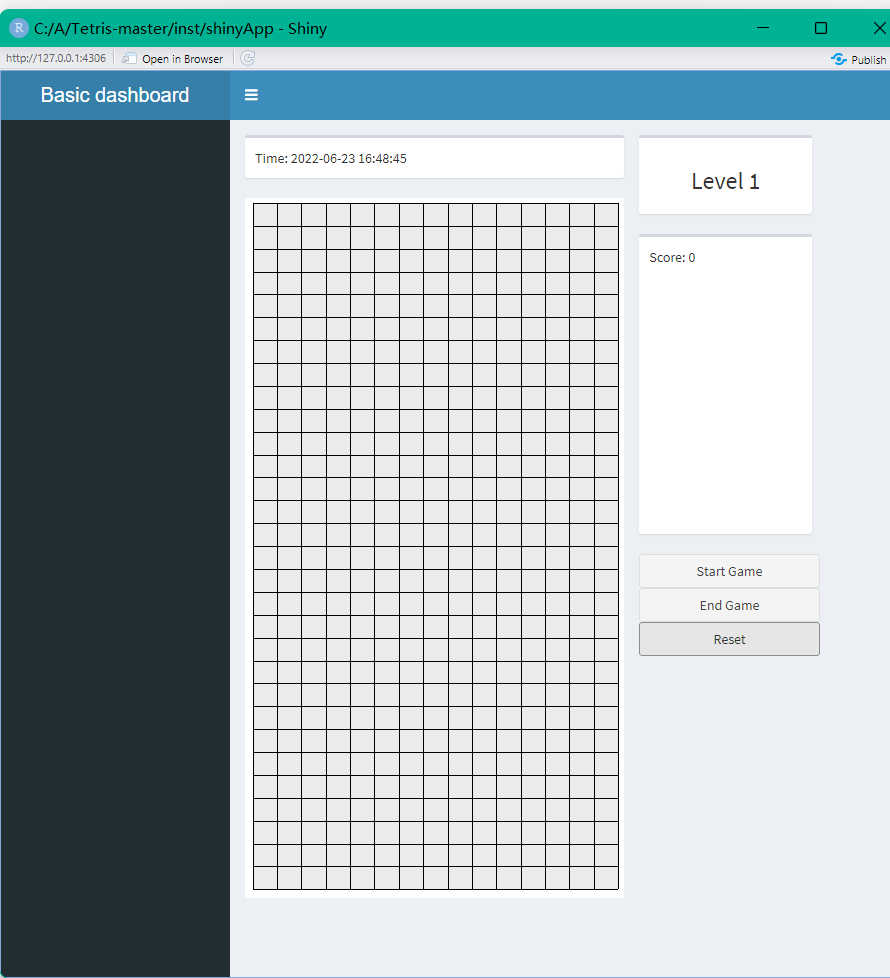

# Tetris
Tetris game with shiny app in R


## Installation
```r
devtools::install_github("https://github.com/TingtHou/Tetris.git")
```
## Usage
```r
launchGame()
```
Use "左"/"右" to move tetriminos to left/right

Use "S" to move down tetriminos
Use "Space" to move down tetriminos quickly
Use "W" rotate tetriminos
Use "D" rotate tetriminos

## Limitation
The figure will flash when the game runs a long time.

## The folder structure
```r
- Tetris 
  |- inst 
     |- shinyapp 
         |- ui.R
         |- server.R
  |- R
     |- shiny.R
     |- TableID.R
     |- GameAction.R 
     |- TableAction.R 
     |- TetrominoAction.R 
  |- DESCRIPTION 
  |- ... 
```
## Program process:

